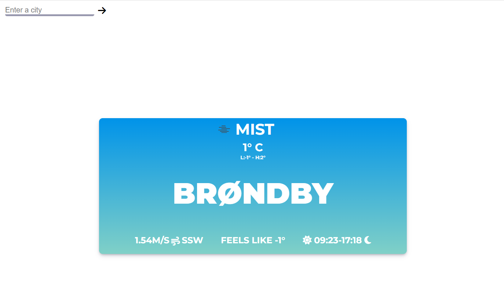
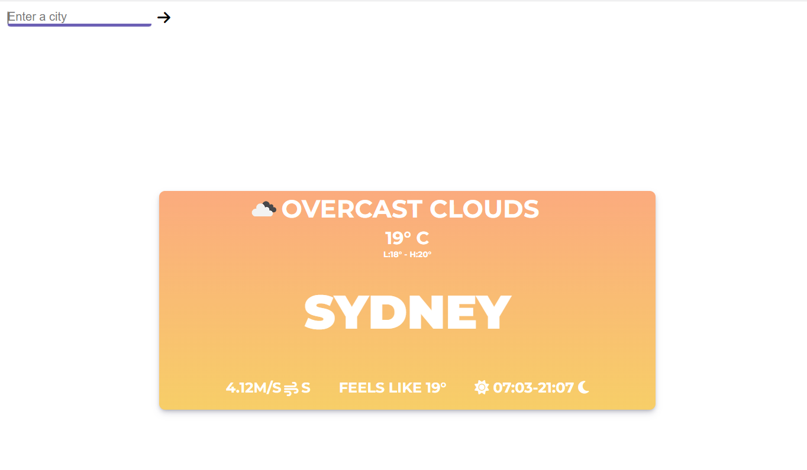
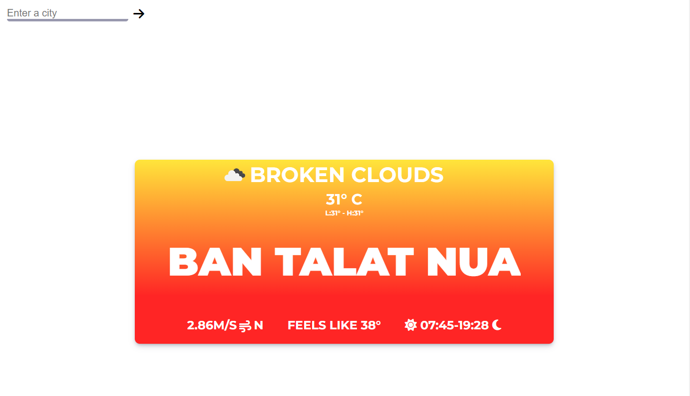

# Weather APP

A project designed as part of the curriculum for HackYourFuture Denmark.
Built using HTML, CSS, and JavaScript, this app offers real-time weather updates for your location.

I decided to build the UI using Javascript in order to get more preparation in writing JSX.

In order to run the project you will have to add your own API KEY from [OpenWeather](https://openweathermap.org/).

#

### The tasks completed for this weather app project included:

:white_check_mark: Display data for the current location using GeoLocation.

:white_check_mark: Retrieving and displaying the current weather information for a chosen city, including temperature, weather icon, wind speed, cloudiness and sunrise/sunset times.

:white_check_mark: As aditional feature of the app, I added the direction of the wind.

#

### Future improvments:

:radio_button: Support for different screen sizes.

:radio_button: Displaying the map with location.

#

### Examples

