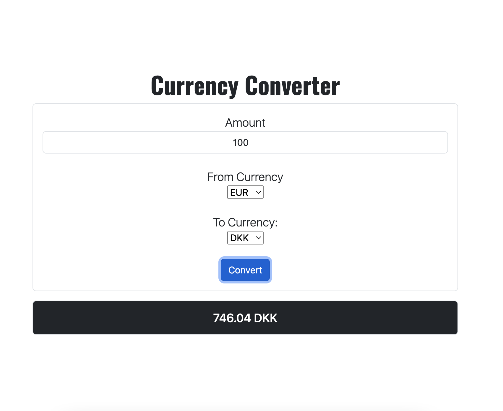

# Currency Calculator APP

A project designed as part of the curriculum for HackYourFuture Denmark.

This programming project is a currency calculator that utilizes HTML, JavaScript, and Bootstrap for styling.

The calculator allows users to quickly and easily convert between different currencies.

It has a user-friendly interface and is responsive, making it accessible on various devices.

The calculator uses live exchange rates, ensuring that users always have the most up-to-date information.

#

### The tasks completed for this weather app project included:

:white_check_mark: Make a request to the API and store the Exchange rates as well as a list of currencies for the dropdowns.

:white_check_mark: User can enter an amount.

:white_check_mark: User can choose a currency to convert from(default should be EUR).

:white_check_mark: User can choose a currency to convert to(Default should be DKK).

:white_check_mark: Whenever amount, currency from or currency to changes we show what the amount translates to in the to currency.

#

### Examples

